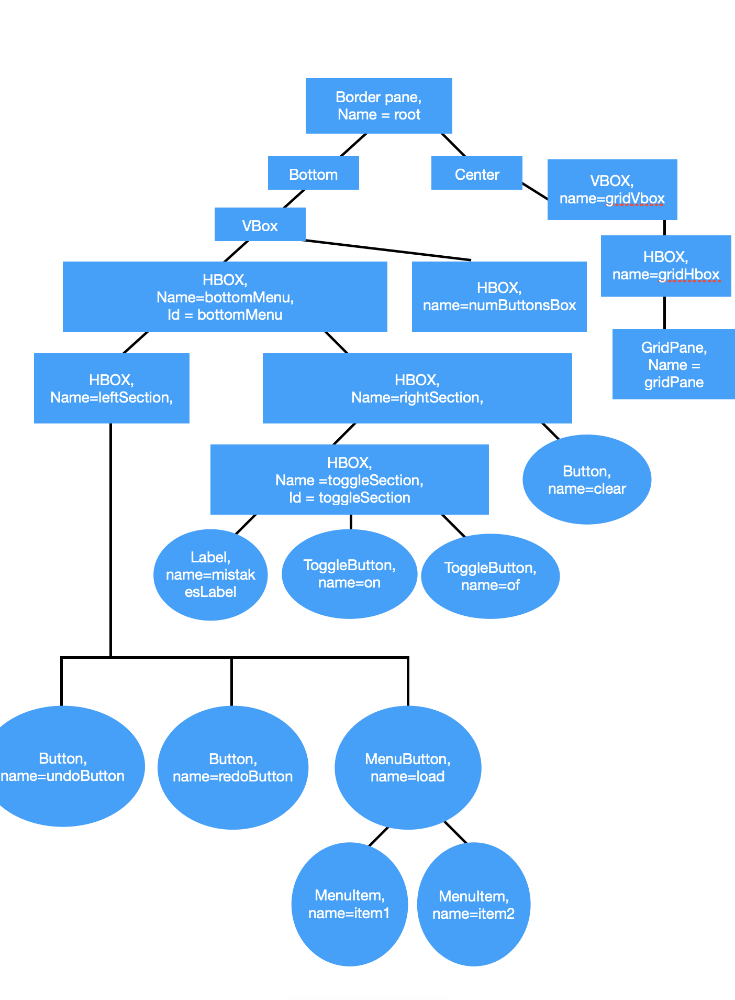

# MathDoku (KenKen)

How to compile and run your code from the command line:

If you are running Java 11 or later, you will need to download the JavaFX libraries separately.Now to compile the application, simply type:
javac --module-path=(path to javaFX folder)/javafx-sdk-11.0.2/lib --add-modules=ALL-MODULE-PATH Main.java
Then you can run the application using:
java --module-path=(path to javaFX folder)/javafx-sdk-11.0.2/lib --add-modules=ALL-MODULE-PATH Main

Coursework Instructions:

<object data="Instructions.pdf" type="application/pdf" width="700px" height="700px">
    <embed src="Instructions.pdf">
        
This browser does not support PDFs. Please download the PDF to view it: <a href="Instructions.pdf">Download PDF</a>.

    </embed>
</object>

# mathDoku
